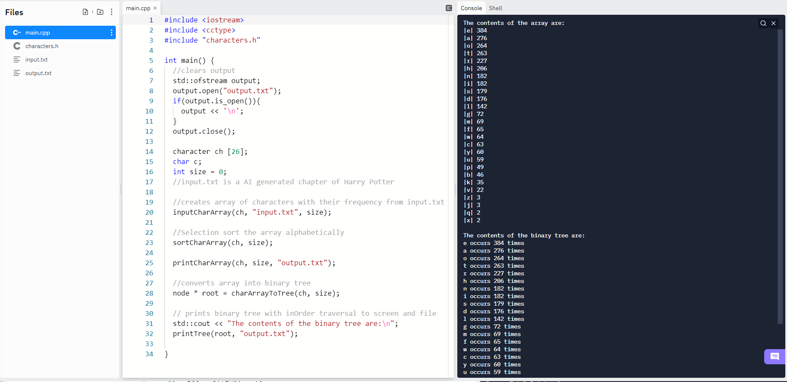
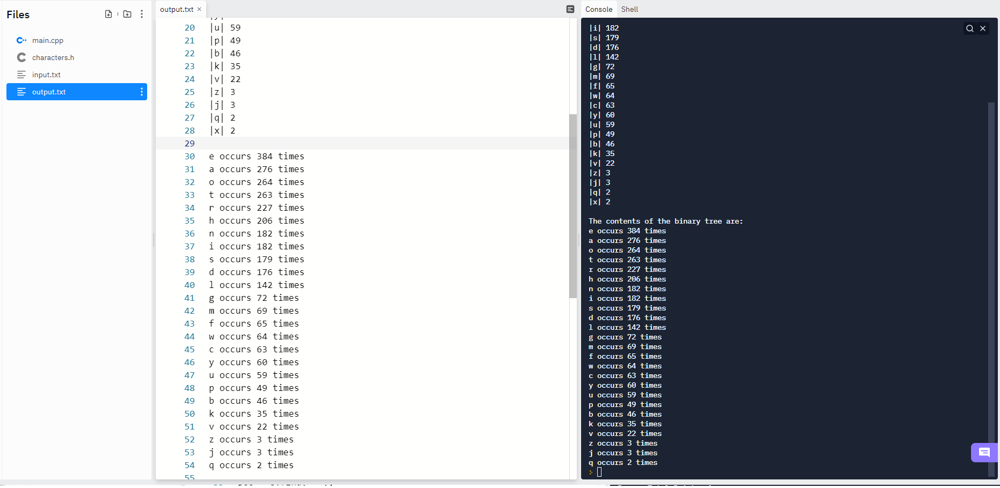

# Data Structures 5
 
## Assignment 5 for Data Structures as Northeastern State University

## Outputs the number of times each character occurs in an input file

This program reads each character from an input file one at a time. It calculates the total number of times each character occurs in the input file. This program only considers alphabetic characters, and ignores capitalization. Once the program has calculated and stored the number of occurances of each character in an array, it sorts the array from most to least occurances. That array is also stored as a binary tree. The array and binary tree are also printed to the console and to an output file.

#### Character struct that makes up the array of characters and their occurances
```
struct character{
  char c = '*';
  int num = 1;
};
```

The program starts by instantiating the array of **characters** that will store each character along with its number of occurances. This array has a size of 26 since it will only contain alphabetic characters. The program then calls a function which reads the input file one character at a time. It ignores every non alphabetic character as it reads. Each new character found is stored in the array with a **number** of 1. If a character is found which is already in the array the **number** is incremented by one instead.

#### The function which finds the number of occuranced of each character in the input file, and ouputs the data to the array
```
void inputCharArray(character ch[], std::string str, int &size){
char c;
std::string filename(str);
  FILE* input = fopen(filename.c_str(), "r");
  bool stored;
    while(!feof(input)){
      stored = false;
      c = tolower(getc(input));
      if(isalpha(c)){
      for(int i = 0; i < size; i++){
        if(ch[i].c == c){
          ch[i].num++;
          stored = true;
        }
      }
      if(stored == false){
        ch[size].c = c;
        size++;
        }
      }
    }
    fclose(input);
}
```

Next, a function is called that conducts a bubble sort on the array, sorting it by the number of occurances of each character. Once the array is soted a function is called to print the array to the console and to a file called **output.txt**. A function is then called, which stores the values in the array into a binary tree with **in order** traversal. The binary tree is then printed to **output.txt** and the console.

#### An example of the program running with the input from * *Harry Potter and the Portrait of what looked like a Large Pile of Ash* * 



